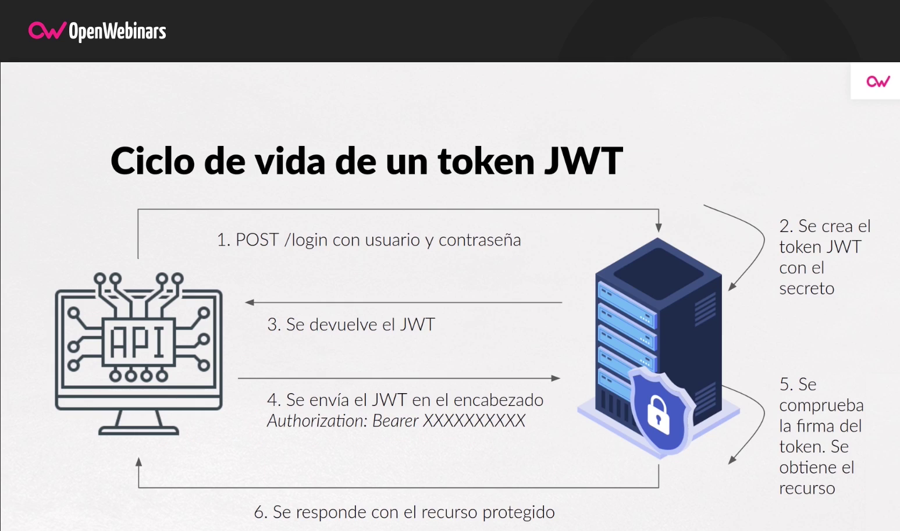

## Implementación de JWT en ASP.NET Core 6
### En este proyecto, se aborda la implementación de JSON Web Tokens (JWT) en ASP.NET Core 6. 

JSON Web Tokens son una forma segura de transmitir información entre diferentes partes de una aplicación, 
como entre un cliente y un servidor. Esta técnica se utiliza ampliamente para habilitar la autenticación y
la autorización en aplicaciones web y APIs.

El objetivo principal de utilizar JSON Web Tokens (JWT) en una aplicación es habilitar la autenticación y 
la autorización de manera segura y eficiente. JWT es un estándar abierto (RFC 7519) que proporciona un 
mecanismo para transmitir información entre diferentes partes de una aplicación de una forma compacta y autónoma.

Algunos de los principales objetivos de usar JWT son:

- Autenticación del usuario: JWT se utiliza comúnmente para autenticar usuarios en aplicaciones web y APIs. Una vez que un usuario inicia sesión en la aplicación y se verifica su identidad, se emite un JWT que contiene información sobre la identidad del usuario. Este token se envía al cliente y se incluye en las solicitudes posteriores para autenticar al usuario en cada interacción con la aplicación.

- Intercambio seguro de información: Los JWT son firmados digitalmente y pueden cifrarse para garantizar la integridad y confidencialidad de los datos transmitidos. Esto permite intercambiar información sensible entre diferentes partes de la aplicación de manera segura y protegida contra manipulaciones no autorizadas.

- Sesiones sin estado (stateless): Los JWT son tokens autocontenidos, lo que significa que toda la información necesaria para autenticar y autorizar a un usuario se encuentra dentro del propio token. Esto permite que las aplicaciones sean "sin estado", es decir, no necesitan almacenar información de sesión del usuario en el servidor. Cada solicitud del cliente incluye el JWT, y el servidor puede verificar y extraer la información necesaria para responder de manera adecuada.

- Escalabilidad: Al eliminar la necesidad de almacenar información de sesión en el servidor, las aplicaciones que utilizan JWT pueden ser más escalables y fáciles de implementar en entornos distribuidos o con múltiples instancias del servidor.

- Interoperabilidad: JWT es un estándar ampliamente adoptado, lo que significa que es compatible con una amplia variedad de lenguajes de programación y frameworks. Esto facilita su implementación en diferentes entornos y tecnologías.

- Tiempo de expiración: JWT puede incluir una fecha de expiración (exp), lo que permite establecer límites de tiempo para la validez del token. Esto es útil para garantizar que los usuarios vuelvan a autenticarse después de un período determinado o para revocar el acceso de un usuario en caso de que sea necesario.

Fuente de la imagen: [openwebinars](https://openwebinars.net/blog/que-es-json-web-token-y-como-funciona/)
